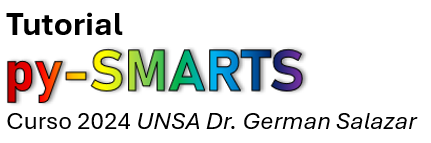

# Tutorial 2024 pySMARTS para la clase del Dr. German Salazar, UNSA 
Bienvenidos

* [**0.**: Introduccion a Jupyter y Python](https://colab.research.google.com/github/PV-Tutorials/2024_pySMARTS_UNSA/blob/main/0.%20Introduccion%20a%20Jupyter%20y%20Python.ipynb)
* [**1.**: Uso simple de pySMARTS](https://colab.research.google.com/github/PV-Tutorials/2024_pySMARTS_UNSA/blob/main/1.%20Uso%20simple%20de%20pySMARTS.ipynb)
* [**2.**: Efecto de aerosoles](https://colab.research.google.com/github/PV-Tutorials/2024_pySMARTS_UNSA/blob/main/2.%20Efecto%20de%20aerosoles.ipynb)

### Google Colaboratory
To run these tutorials in [Google Colaboratory](https://colab.research.google.com/)
you can click the button below:

You can also select Colaboratory from the launch icon at the top of each tutorial
in the [Jupyter book](https://pvsc-tutorials.github.io/2024_pySMARTS_UNSA/index.html).

### Licensing

 This work is licensed under a <a rel="license" href="http://creativecommons.org/licenses/by/4.0/">Creative Commons Attribution 4.0 International License</a>.
